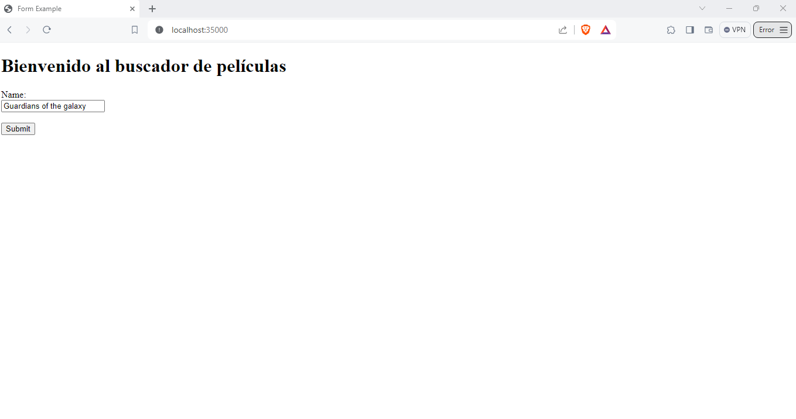

# TALLER 1: APLICACIONES DISTRIBUIDAS

Se dearrolla una página web sencilla que realiza consultas gratuitas al API de películas <https://www.omdbapi.com/>. La página web presenta en formato JSON la información de una película especifica al recibir su título como parámetro.

### Prerrequisitos
Los prerrequisitos tecnológicos que necesita este taller son:

* [Maven](https://maven.apache.org/):Maven es un herramienta que proporciona una estructura estándar, gestión de dependencias y automatización de tareas en los proyectos software desarrollados en Java.

* [GitHub](https://platzi.com/blog/que-es-github-como-funciona/): Es una plataforma de desarrollo colaborativo basado en Git que utiliza un sistema de versiones distribuida para el seguimiento del código fuente durante el desarrollo. 

### Instalación
1.  Primero se clona el repositorio:
```
git clone https://github.com/AREP-2024/Taller1.git
```

2. Se accede al repositorio que se acabo de clonar
```
cd Taller1
```
3. Se hace la construcción del proyecto:
```
mvn package
```

### Corriendo 
1.  Se deben poner en ejecución los siguientes comandos:
```
 mvn clean package install
 mvn clean install
```

2. Ahora de debe poner a ejecutar el servidor:

#### Windows
```
 mvn exec:java -"Dexec.mainClass"="edu.escuelaing.arep.ASE.app.HttpServer"
```

#### Linux/MacOs
```
 mvn exec:java -Dexec.mainClass="edu.escuelaing.arep.ASE.app.HttpServer"
```

3. Por último accedemos desde cualquier browser con la siguiente URL:
 ```
http://localhost:35000/
 ```
 
 En la siguiente imagen usted podrá observar cómo debería cargar la pagina web:
 


### Test

Se ejecuta el siguiente comando:
 ```
 mvn test
  ```

se ejecuta el comando 

### Construido con

* [Maven](https://maven.apache.org/): Maven es un herramienta que proporciona una estructura estándar, gestión de dependencias y automatización de tareas en los proyectos software desarrollados en Java.

* [GitHub](https://platzi.com/blog/que-es-github-como-funciona/): Es una plataforma de desarrollo colaborativo basado en Git que utiliza un sistema de versiones distribuida para el seguimiento del código fuente durante el desarrollo. 

* [Visual Studio Code](https://code.visualstudio.com/):Es un entorno de desarrollo integrado (IDE) ligero y de código abierto desarrollado por Microsoft

* [Java 17](https://www.java.com/es/download/help/whatis_java.html): Es un lenguaje de programación de propósito general, orientado a objetos y diseñado para ser independiente de la plataforma. 

* [HTML](https://developer.mozilla.org/es/docs/Web/HTML): Es el lenguaje de marcado que se utiliza para crear páginas web. Se define como un conjunto de etiquetas que se utilizan para estructurar y dar significado al contenido de una página web.

* [JavaScript](https://aws.amazon.com/es/what-is/javascript/): Es un lenguaje de programación de alto nivel, interpretado y orientado a objetos. Se utiliza principalmente en el desarrollo web para crear páginas web interactivas y dinámicas

### Autor
[Luisa Fernanda Bermudez Giron](https://www.linkedin.com/in/luisa-fernanda-bermudez-giron-b84001262/)

### Licencias 

**©** Luisa Fernanda Bermudez Giron, Estudiante de Ingeniería de Sistemas de la Escuela Colombiana de Ingeniería Julio Garavito.